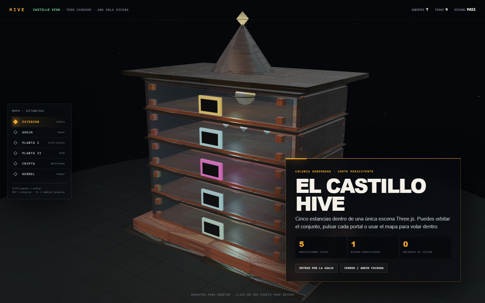

# HIVE Castle World

Prototipo Three.js que convierte la colmena Langstroth procedural en un
castillo HIVE persistente, explorable en 3D/2.5D. No sustituye el runtime de
HIVE: es una superficie de observación que representa sus estancias y mantiene
el ledger como fuente de verdad.



## Qué contiene

- Una única escena WebGL con cinco habitaciones cargadas desde el arranque:
  Aguja, Planta I, Planta II, Cripta y Kernel.
- Castillo procedural abierto, construido a partir del lenguaje de cajas,
  uniones y materiales PBR del modelo Langstroth original.
- Portales 3D clicables mediante raycasting.
- Mapa persistente y navegación por teclado (`Esc`, `↑`, `↓`).
- Vuelos de cámara interpolados entre habitaciones, sin navegar ni reconstruir
  la página.
- Paneles siempre montados para Queen, workers, recovery, BARTOLOMEO y ledger.
- Adaptación móvil y `prefers-reduced-motion`.
- Materiales locales de madera, metal galvanizado y entrada; no depende de un
  CDN para Three.js.

## Ejecutar

Desde la raíz de `img2threejs`:

```powershell
cd work/hive
npm install
npx playwright install chromium
cd ../..
python -m http.server 8765 --bind 127.0.0.1
```

Abrir:

```text
http://127.0.0.1:8765/work/hive/viewer/
```

El servidor debe arrancar en la raíz del repositorio porque el visor resuelve
los módulos locales y los mapas PBR desde `work/hive`.

## Verificar

Con el servidor activo en el puerto 8765:

```powershell
cd work/hive
npm test
npm audit --omit=dev
```

El verificador abre Chromium y prueba:

1. precarga terminada antes de interactuar;
2. topología de 6 vistas, 6 paneles y 5 portales 3D;
3. entrada a Planta I pulsando el portal WebGL, no el menú;
4. una posición intermedia real durante el vuelo P1 → Kernel;
5. visita a todas las estancias sin nuevas peticiones de recursos;
6. una sola navegación de documento;
7. menú, panel y ausencia de overflow en 375×812;
8. errores de consola y red.

## Resultado medido · 2026-07-27

| Predicado | Resultado |
|---|---:|
| Veredicto interactivo | `PASS` |
| Recursos antes/después de recorrer todas las salas | `11 → 11` |
| Navegaciones de documento | `1 → 1` |
| Paneles que permanecen montados | `6 / 6` |
| Portales 3D | `5 / 5` |
| Overflow horizontal desktop / móvil | `0 px / 0 px` |
| Errores de consola/red | `0` |
| Distancia de vuelo medida P1 → Kernel | `3.000` unidades |
| Vulnerabilidades npm | `0` |

Capturas generadas por el gate:

- [`verification/exterior-desktop.png`](verification/exterior-desktop.png)
- [`verification/kernel-desktop.png`](verification/kernel-desktop.png)
- [`verification/p2-mobile.png`](verification/p2-mobile.png)

## Archivos principales

- `viewer/index.html`: escena, geometría, materiales, navegación y UI.
- `verify.mjs`: acceptance visual e interactivo.
- `createLangstrothBeehiveModel.ts`: reconstrucción procedural original que
  sirve como base geométrica y material.
- `object-sculpt-spec.json`: contrato de escultura y evidencia.
- `pbr_*`: mapas y reportes PBR derivados de la referencia.

## Límites actuales

- Los datos operativos de las habitaciones son fixtures visuales; todavía no
  consumen el event store o SSE de HIVE.
- La escena representa el castillo como corte abierto, no como recorrido
  first-person con colisiones.
- Los mapas PBR proceden de una sola imagen y siguen siendo una aproximación,
  no inverse rendering físico.
